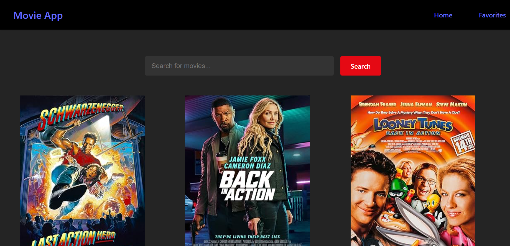

# Search Movies 

This is my first **React** project: a simple movie searching website that runs locally.  
I built it by following a FreeCodeCamp YouTube tutorial by **Tech With Tim**.
 
https://www.youtube.com/watch?v=G6D9cBaLViA

---

## Features 🚀
- Search for movies in the search bar.
- View posters, movie titles and release years for each search result.
- Add or remove movies from Favourites.

---

## Screenshots 📷

### Home Page

### Favorites Page

